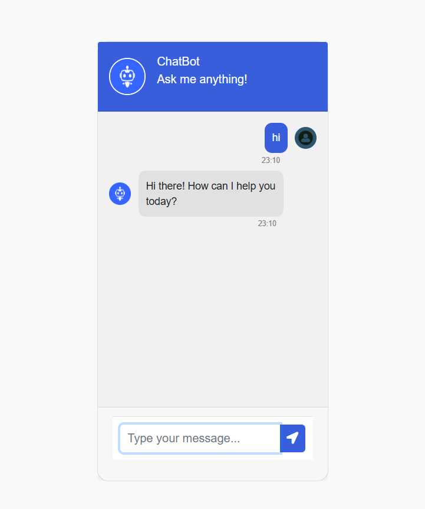

# AI Chatbot


## About
A web-based chatbot application powered by Google's Gemini AI. This application uses Flask for the backend and provides a responsive chat interface for users to interact with the Gemini AI model.



## Features
- Real-time chat interface
- Integration with Google's Gemini AI model
- Responsive design using Bootstrap
## Demo
  <br>
https://www.youtube.com/watch?v=v8dCfWvjtaQ
## Prerequisites
- Python 3.7 or higher
- Google Gemini API key
## Installation & Setup

[Install Python] https://www.python.org/downloads/

[Install pip]

```
curl https://bootstrap.pypa.io/get-pip.py -o get-pip.py
```

```
python3 get-pip.py
```

Ensure pip is installed by running the following command

```
pip --version
```

If you have Python & pip installed then check their version in the terminal or command line tools

```
python3 --version
```

```
pip --version
```

## Installing Flask

In your terminal run the requirements.txt file using this pip

```
pip install -r requirements.txt
```
